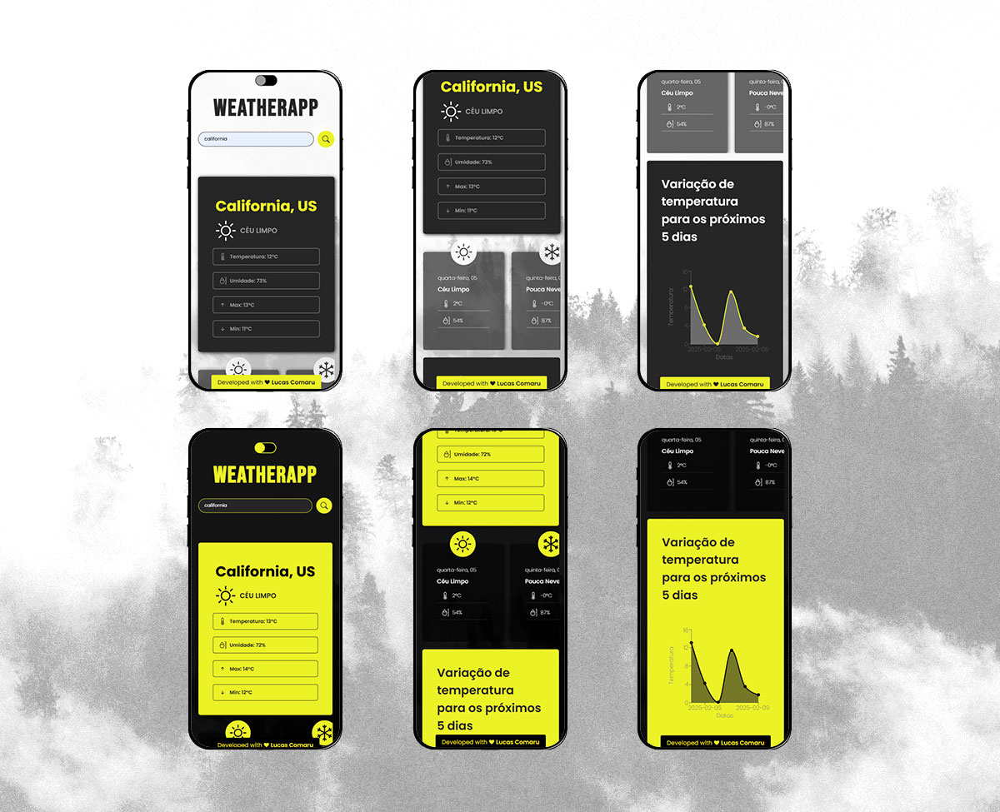

<p align="center">
    
    
    
    
    
    
    
</p>

# ❄️ Weather App

## 📢 Descrição do Projeto

<p align="left">
    Esse projeto foi criado como forma de desafio Front End pelo laboratório Lapisco com o objetivo geral de avaliar o nível de conhecimento dos bolsistas.
</p>

<p align="left">
    <i>O projeto tem caráter experimental e visa a prática do conhecimento.</i>
</p>

### 🎯 Objetivo

<p align="left">
    Criar uma aplicação de previsões meteorológicas utilizando React, realizando consulta das informações em APIs, tratando os dados recebidos para trafegar entre elas e gerar gráficos com os dados.
</p>

### 💻 Requisitos funcionais

- Identificar o IP do usuário ao entrar na página
- Descobrir a localização do usuário pelo IP e retornar previsões meteorológicas
- Buscar cidades e retornar previsões meteorológicas
- Obter informações meteorológicas dos próximos 5 dias
- Gerar gráfico com as temperaturas obtidas
- Mudar o tema com base na preferência de cor do dispositivo do usuário

### 📐 Estrutura de pastas


### 📱 Telas



### 🛠️ Ferramentas utilizadas

<p>
    
</p>

<ul>
    <li><b>JavaScript:</b> Linguagem de programação principal.</li>
    <li><b>HTML:</b> Estruturação da página.</li>
    <li><b>CSS:</b> Estilização e diagramação do conteúdo.</li>
    <li><b>NPM:</b>Gerenciador de pacotes.</li>
    <li><b>ReactJS:</b>Biblioteca de desenvolvimento Front-end.</li>
    <li><b>Styled Components:</b>Biblioteca de estilização de componentes.</li>
    <li><b>Axios:</b>Biblioteca de requisições HTTP.</li>
    <li><b>Visual Studio Code:</b> Ambiente de Desenvolvimento Integrado (IDE).</li>
    <li><b>Figma:</b> UI deisgn.</li>
</ul>

## ⚙️ Pré-requisitos

<p>
    Antes de começar, verifique se você atendeu aos seguintes requisitos:
</p>

- Uma máquina `<Windows / Linux / Mac>` ou um smartphone `<Android / iOS>`.
- A versão mais recente de um dos principais navegadores `<Chrome / Firefox / Edge / Opera>` instalada.
- A versão mais recente do `NodeJs` instalado.

## 📥 Dependências

```
"axios": "^1.7.9",
"react": "^18.3.1",
"react-dom": "^18.3.1",
"react-router-dom": "^7.1.5",
"recharts": "^2.15.1",
"styled-components": "^6.1.14"
```

## 🪛 Apis

- <b>IPify:</b> Obtém IP do usuário
- <b>IPgeolocation:</b> Disponibiliza a localização baseada no IP
- <b>OpenWeather:</b> Disponibiliza informações meteorológicas

## 🖌️ Estilo dos componentes

<p align="left">
    As cores dos componentes estão armazenadas em um objeto no arquivo Theme.jsx.
    Para alterar as cores dos componentes, acrescentar novas cores ou retirar, basta alterar os valores diretamente no objeto.
</p>
<p align="left">
    Caminho: <b>src\theme\Theme.jsx</b>
</p>

```
export let theme = {
  white: "#FFFFFF",
  blue: "#010326",
  grey: "#262626",
  lightGrey: "#9b9b9b",
  black: "#000000",
  blackOpacity: "#00000090",
  yellow1: "#EBF227",
  yellow2: "#F2E422",
  yellow3: "#8C851C",
};
```

<p align="left">
     Os componentes estão estilizados com a biblioteca <b>Styled Components</b>. Para fazer as alterações, basta modificar os valores do objeto no CSS do componente.
</p>

<p align="left">
    <b>Exemplo:</b>
</p>

```
import styled from "styled-components";
import { theme } from "../theme/Theme";

const StyledFooter = styled.div`
  color: ${theme.yourColor}; // Verifique se theme.yourColor está definido corretamente
  display: flex;
  justify-content: center;
  width: 300px;
  position: fixed;
  bottom: 0;
  left: 50%;
  transform: translateX(-50%);
  border-radius: 4px 4px 0 0;
  background-color: ${theme.yourColor};
`;
```

## ☕ Usando o projeto

1. Certifique-se que você tem o NodeJS intalado em sua máquina através do comando no terminal.

```
node -v
```

2. faça o download do repositório.

```
git clone https://github.com/lucasfcomaru/weather_app.git
```

3. instale as dependências.

```
npm install
```

4. Crie um cadastro nas APis abaixo para obter uma chave

```
https://ipgeolocation.io/
https://openweathermap.org/
```

5. Crie as variáveis de ambiente na raiz do projeto com um arquivo .env

```
VITE_WEATHER_API_KEY=SUA_CHAVE_AQUI
VITE_GEOLOCATION_API_KEY=SUA_CHAVE_AQUI
```

5. Execute o comando abaixo e clique no link que aparecerá no terminal

```
npm run dev
```

### 🎮 Deploy

<p align="left">
    Veja o projeto completo em:
    <a href="https://weather-app-pi-self-71.vercel.app/"> https://weather-app-pi-self-71.vercel.app/</a>
</p>